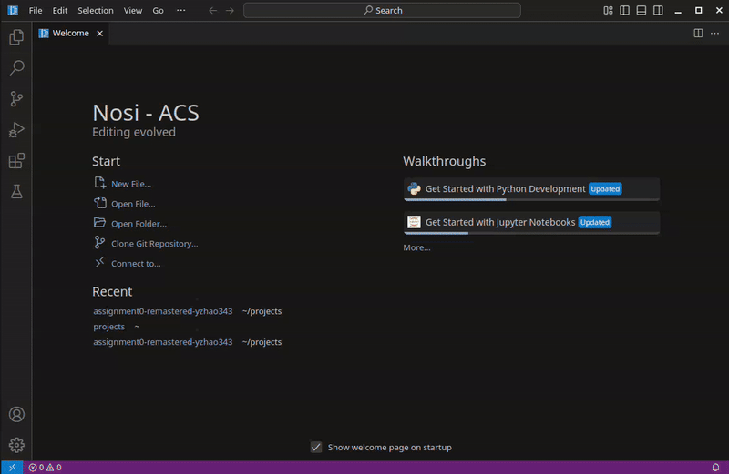
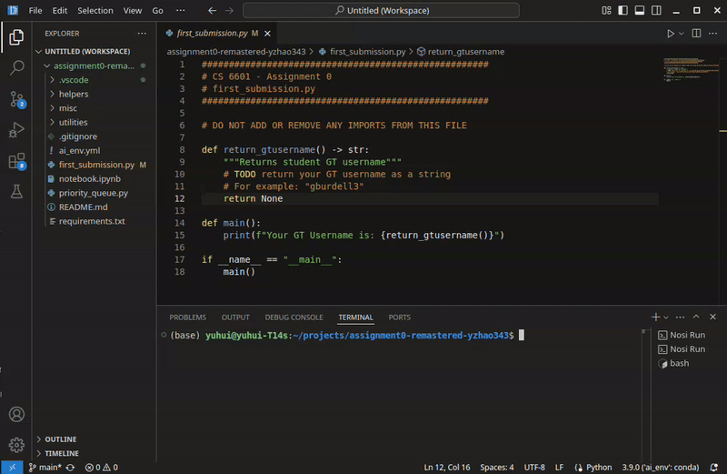
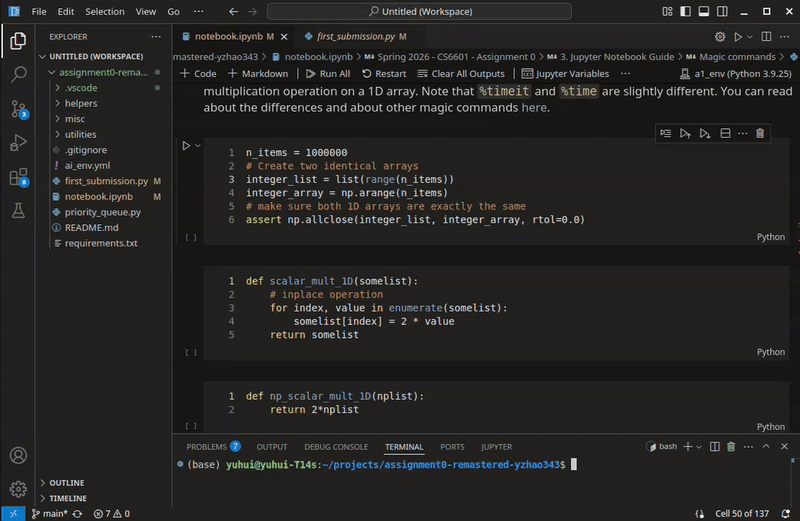
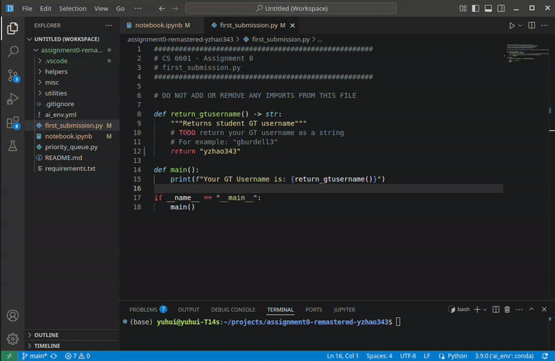
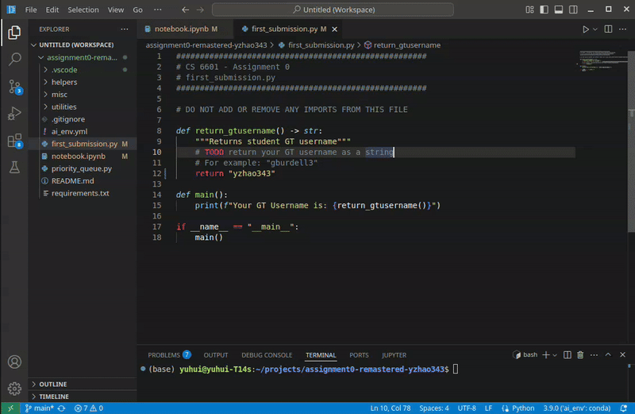
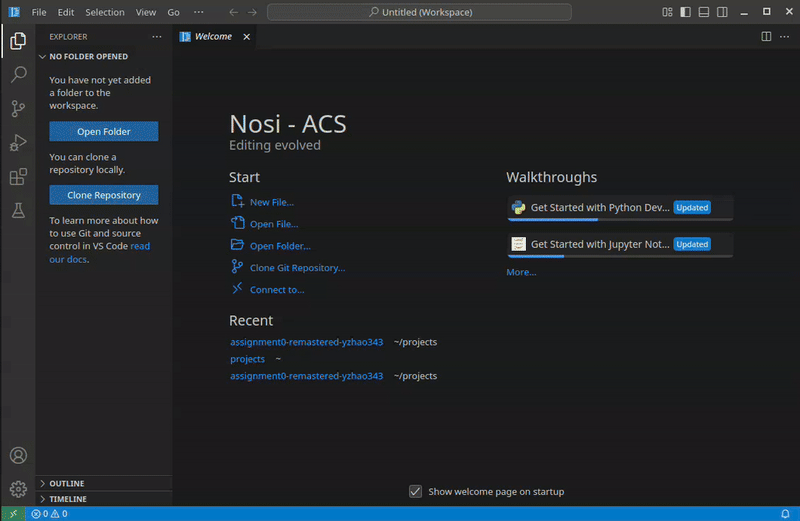
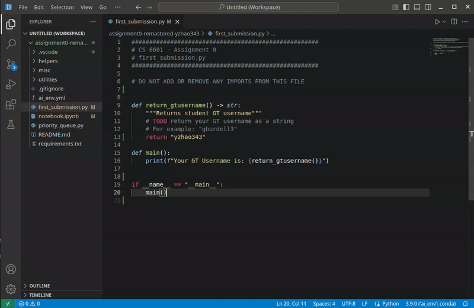
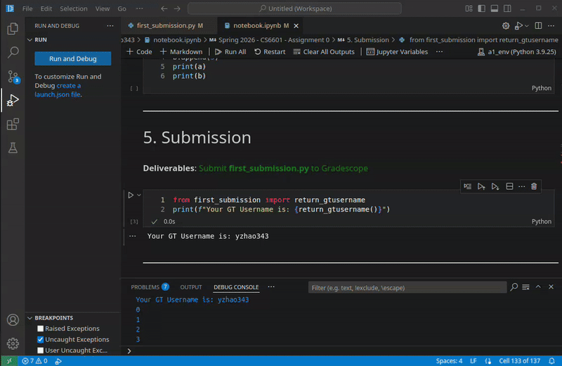
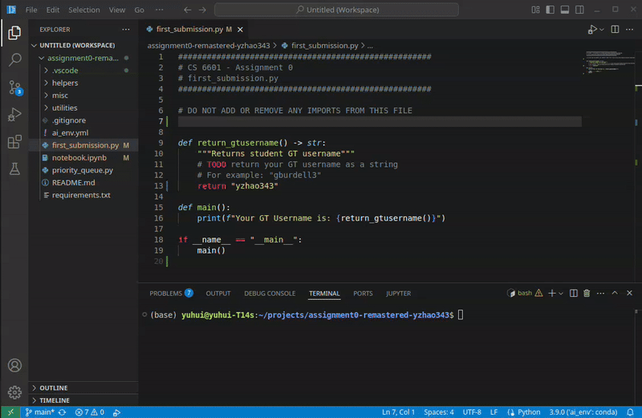

# Nosi

Nosi is an IDE created from adding functionality to a fork of vscode. Nosi allows course staffs to have full control over their class's IDE environment. This is accomplished by encrypting all homework files. Students must use the Nosi IDE to view the decrypted version of the files. The staff can choose to enable/disable different features of the IDE based on their course such as extensions. Nosi can also be used as an anti-cheating/anti-plagiarism tool. Nosi monitors all behavior *within* the IDE and keeps encrypted metadata as the student works on their assignments. When students submit their files, scripts and AI models are run on the metadata to flag suspicious behaviors. Since data is only collected within the IDE, students are free to use multiple devices to work on the assignment, use virtual machines (typically banned with other anti-cheating tools such as Honorlock), and perform normal behaviors on their computers without having any monitoring of any kind. On top of this functionality, Nosi also provides an AI assistant that can nudge students with helpful information when they're stuck on their assignments or explain course content. The tool was initially rolled out to CS 6601: Artificial Intelligence in Spring 2026.

Future Additions:
- Cloud hosted version of Nosi so students don't have to install any software on their machine if they choose not to
- Improving AI assistant
- Creating more staff tools for viewing plagiarism issues

Its goal is to improve coding education, especially addressing the challenges posed by Large Language Models (LLMs). Nosi is designed to edit and run the encrypted homework templates files distributed to students. It logs interaction data during the coding/editing process. In the short term, these behavioral data are used to ensure students are producing their own work in accordance with academic integrity policies. Specifically:
 * Encryption: Designed to add “friction” to prevent the direct use of LLMs to solve assignments.
 * Logging: Used to validate potential violations by analyzing the process of creation, not just the final result.
In the long term, Nosi will evolve into an interactive, AI-powered IDE that can detect learning difficulties and provide real-time pedagogical support.

## Nosi features and common operations
Below are key features the latest Nosi v0.0.3 supports. Please use it to gauge how it affects your regular coding work flow.
### Opening and removing assignment folder in workspace

### Running encrypted python files

### Running encrypted ipynb files

### Installing extensions and changing theme

### Syntax Error highlighting

### Search/replace by highlighting, then ctrl+f/ctrl+h, and redo by ctrl+z
Note: don't highlight, ctrl+c and then ctrl+v into the search box as it will paste as encrypted text. Just highlight the text, and ctrl+f for search and ctrl+h for replace.

### Ruff setup and file formatting
Install Ruff([link](https://docs.astral.sh/ruff/)) by running `pip install ruff` in your conda base environment first.

To format files, run `ctrl+shift+p` to bring up the command palette and type or select `Format Document` or `Format Document With...` -> `nosi-extension`

Changing the Ruff linter and formatter default setting is currently not supported.

### Hover window and auto fix (via ruff)

### Debug encrypted python files

### Debug encrypted ipynb files.
Note: the button on the upper right corner does not work.

### Limited git extension support (inline git diff view).
Note: currently only the inline git diff view work, split git diff view is work-in-progress

## Supported OS and Platform
 * Windows: x64, arm64
 * Linux - .deb: x64, arm64
 * Linux - .rpm: x64, arm64
 * Linux - .AppImage: x64, arm64
 * Linux - .snap: x64, arm64
 * MacOS: Intel x64, Apple Silicon arm64
 * You can use linux build of Nosi in Windows subsystem for Linux v2 (WSL2)
 * You can install the x64 windows build of Nosi in Gatech VLab virtual machine ([link](https://mycloud.gatech.edu/))

